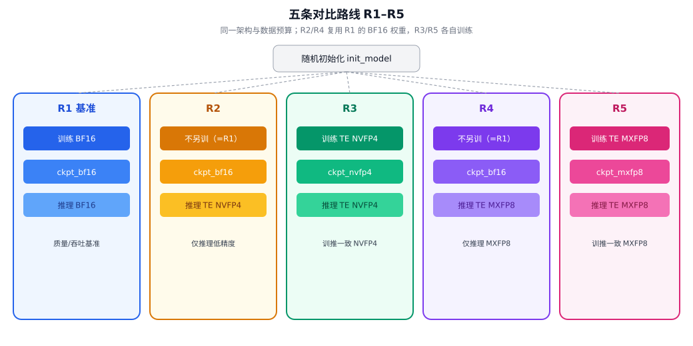
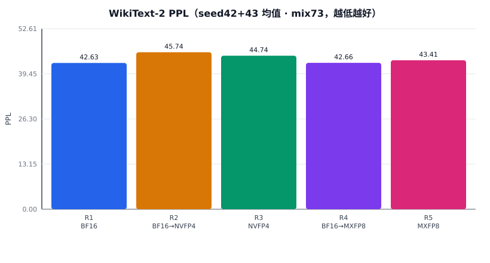

# R1–R5 低精度训练与推理对比实验技术报告

**面向读者：** 具备基础深度学习与 Python 经验，**不要求**事先了解 FP8/FP4 或 Transformer Engine。  
**实验代码：** 仓库 `mxfp4_route_compare`  
**环境：** `nvcr.io/nvidia/pytorch:26.07-py3` · 4×NVIDIA GB200  
**主线配置：** SmolLM2-360M 架构 · EN/ZH **7:3** 混合语料 ~7B tokens（FineWeb-Edu + FineWeb-2 `cmn_Hani`）· **seed 42 与 seed 43 均已完成**

---

## 0. 摘要

大型语言模型训练与推理中的绝大部分计算，是矩阵乘法（GEMM）。若能在**可接受的质量损失**下，用更少比特表示参与乘法的数值，就有机会：

- 提高 Tensor Core 峰值吞吐；
- 降低显存占用与带宽压力。

本实验在**同一模型结构、同一数据预算、同一随机初始化协议**下，对比五条路线（Transformer Engine **硬件**低精度路径；**不是**软件 fake-quant）：

| 路线 | 训练 | 推理 | 权重文件 |
|------|------|------|----------|
| **R1** | BF16 | BF16 | `ckpt_bf16` |
| **R2** | 同 R1（不另训） | TE **NVFP4** | 复用 `ckpt_bf16` |
| **R3** | TE **NVFP4** | TE **NVFP4** | `ckpt_nvfp4` |
| **R4** | 同 R1（不另训） | TE **MXFP8** | 复用 `ckpt_bf16` |
| **R5** | TE **MXFP8** | TE **MXFP8** | `ckpt_mxfp8` |

**质量指标：** WikiText-2 困惑度（PPL，越低越好；**英语** eval）。  
**性能指标：** 训练/推理 tokens/s（microbench + 实训稳态）。

**主线结论（seed 42 + 43 · mix73 · 26.07）：**

| 路线 | seed42 | seed43 | mean | mean vs R1 |
|------|-------:|-------:|-----:|-----------:|
| R1 BF16 | **43.12** | **42.14** | **42.63** | 1.00× |
| R2 BF16→NVFP4 | **45.88** | **45.61** | **45.75** | 1.07× |
| R3 NVFP4 训推 | **43.98** | **45.50** | **44.74** | 1.05× |
| R4 BF16→MXFP8 | **43.19** | **42.12** | **42.66** | 1.00× |
| R5 MXFP8 训推 | **44.00** | **42.81** | **43.41** | 1.02× |

1. **R4 几乎贴齐 R1**（两 seed 均成立；BF16 训练 + MXFP8 推理质量损失可忽略）。  
2. **R2 始终最差一侧**；**R3 的收益有 seed 方差**：seed42 明显好于 R2，seed43 与 R2 接近。  
3. R5 相对 R1 约 +2% PPL（双 seed 量级一致）；4 卡 microbench 上 **MXFP8 训练吞吐与 BF16 基本持平**，NVFP4 约 **0.90–0.92×**。  
4. 历史「纯英文 + 26.06」的**绝对 PPL 不可**与本表对比（数据分布变了）；详见附录 E 与 [`EXPERIMENT_SUMMARY.md`](../EXPERIMENT_SUMMARY.md)。

### 生成样例速览（比 PPL 更直观）

seed=42 mix73 权重、`temperature=0.8`、约 64 new tokens。模型约 360M、从零 ~7B tokens：能写出「像自然语言」的句子，但事实错误、重复、串台很常见。

| 类型 | 直观感受 |
|------|----------|
| 英文提示（如法国首都、光合作用） | 常能起对关键词（Paris / plants），后文胡编 |
| 中文提示（如 AI 历史、童话开头） | 能输出中文，但易广告腔、人名串台、叙事断裂 |

完整 **R1–R5 输入/输出 + 人工「观感」（非翻译）** 见仓库首页 [`README.md`](../README.md)。  
定量比较仍以 **PPL 表** 为准。

---

## 1. 背景：从「精度」说起

### 1.1 浮点数在干什么？

计算机用有限位表示实数。常见浮点格式可以粗理解为：

> **符号位 + 指数位 + 尾数位**

- **指数** 决定能表示多大/多小的数（动态范围）。  
- **尾数** 决定小数有多精细（精度）。  

比特数越少，盒子越小：

- 同一加法/乘法可能更快（尤其有专用硬件时）；
- 但舍入误差更大，训练可能更难稳定。


### 1.2 本报告会用到的几种格式

| 名称 | 大致位数 | 在本实验中的角色 |
|------|----------|------------------|
| **FP32** | 32 | 优化器状态、部分累加等「账本」精度 |
| **BF16** | 16 | **R1** 训练与推理的主精度；动态范围接近 FP32 |
| **FP16** | 16 | 业界常见；本实验 R1 **不采用**（与训练一致用 BF16） |
| **MXFP8** | 8 | **R4/R5** 经 TE 的 block-scaling FP8（E4M3），质量通常更接近 BF16 |
| **NVFP4** | 4 | **R2/R3** 经 TE 的硬件 4bit 格式，更激进 |

不必背位宽细节，记住：

> **BF16 是本实验的「全精度基准」；MXFP8 / NVFP4 是作用在 Linear GEMM 上的硬件低精度路径。**  
> 在同样「只改推理」设定下，一般预期 **MXFP8 比 NVFP4 更接近 R1**（实验中 R4 支持这一点）。

### 1.3 混合精度：不是「整个模型只有一种数」

现代训练几乎都是**混合精度**：

| 对象 | 常见做法 | 直觉 |
|------|----------|------|
| 前向激活 | BF16 / 更低 | 算得快 |
| 权重主副本 | BF16 或 FP32 | 要稳 |
| 梯度 | 与激活类似 | 反传也要算 |
| 优化器动量等 | 常 FP32 | 更新要准 |

**低精度训练**通常指：在保证优化器等关键路径足够准的前提下，把**最耗时的 GEMM** 放到更低精度硬件上做。

### 1.4 为什么需要 Transformer Engine（TE）？

NVIDIA GPU 的 **Tensor Core** 对特定数据布局与缩放方式有硬性要求。  
**Transformer Engine** 提供：

- 与 PyTorch 对接的 `te.Linear`；
- **recipe**（配方），描述如何把张量变成 FP8/NVFP4 并做缩放；
- `te.autocast(...)`，在上下文中自动走低精度 GEMM。

本实验使用的 recipe（**按路线显式选择**，`get_recipe("nvfp4"|"mxfp8")`，不自动「prefer NVFP4」）：

| Recipe 名 | 路线 | 说明 |
|-----------|------|------|
| `NVFP4BlockScaling` | R2/R3 | 按块缩放的 4bit 路径 |
| `MXFP8BlockScaling`（E4M3） | R4/R5 | 按块缩放的 FP8 路径 |

Block scaling：不是对整个张量只用一个 scale，而是切成小块各自缩放，以在低比特下保留更多局部动态范围。

---

## 2. 实验要回答的问题

我们固定：

- 同一套 **SmolLM2-360M 结构**（`from_config` 随机初始化，**不是**官方预训练续训）；
- 同一 **~7B tokens** 训练预算（**mix73**，见 §4）；
- 同一评测：**WikiText-2 PPL**（英语）+ **吞吐**。

然后比较：

1. **全 BF16** 好不好、多快？（**R1**）  
2. 训练仍是 BF16，**只在推理**把 Linear 换成 **NVFP4**，质量掉多少？（**R2**）  
3. **训练阶段就用 NVFP4 GEMM**，推理也用 NVFP4，能否比 R2 更好？（**R3**）  
4. 训练仍是 BF16，**只在推理**换成 **MXFP8**？（**R4**）  
5. **训练与推理都用 MXFP8**？（**R5**）



**关键设计点：**

- R2 / R4 **不单独训练**——直接加载 R1 的 `ckpt_bf16`，评估时 `replace_linears_with_te` + 对应 recipe 的 `te.autocast`。  
- R3 / R5 从**同一** `init_model` 各自训练，权重分别落在 `ckpt_nvfp4` / `ckpt_mxfp8`。  
- 这样可以把「训练时见过低精度」与「只在推理时临时走低精度 GEMM」分开。

---

## 3. 模型结构

### 3.1 架构来源与参数

| 项 | 值 |
|----|-----|
| 配置来源 | `HuggingFaceTB/SmolLM2-360M`（`from_config` 建空结构） |
| 实现类 | `LlamaForCausalLM` |
| 参数量 | 约 **362M** |
| 层数 | 32 |
| `hidden_size` | 960 |
| `intermediate_size` | 2560 |
| Attention heads / KV heads | 15 / 5（**GQA**） |
| `head_dim` | 64 |
| 词表 | 49152（SmolLM2 tokenizer） |

完整结构图见 `figures/fig08_smollm2_360m_arch.svg`。

### 3.2 低精度作用范围（量化 scope）

**只替换 Transformer block 内的 `nn.Linear` 为 `te.Linear`。**

| 模块 | 是否走 TE 低精度 GEMM |
|------|------------------------|
| Attention Q/K/V/O 投影 | 是 |
| MLP up/gate/down | 是 |
| `embed_tokens` | **否**（保持高精） |
| `lm_head` | **否**（保持高精；`include_lm_head=False`） |
| RMSNorm / RoPE 等 | **否** |


设计理由：

- 算力集中在 block Linear；  
- embed / lm_head 对数值敏感、且维度特殊，本实验刻意不动。

---

## 4. 数据与训练配方

### 4.1 数据（mix73）

| 用途 | 数据集 | 说明 |
|------|--------|------|
| 训练英文 70% | FineWeb-Edu `sample-10BT` | ~4.9B tokens |
| 训练中文 30% | FineWeb-2 **`cmn_Hani`** | ~2.1B tokens（普通话·汉字子集） |
| 训练总量 | **7e9 tokens** | `target_tokens: 7000000000` |
| 缓存标签 | `cache_tag: mix73_enzh` | 与旧纯英文 npy **隔离** |
| 训练缓存 | `train_tok7000000000_mix73_enzh_seed42.npy` | int32 memmap |
| 验证 | 同配比约 1e6 tokens | 训练中 val loss |
| 最终质量 | WikiText-2 raw **test（英语）** | 标准 LM 困惑度 |

**实现：** `data.sources[]` 多源 streaming packer（`mxfp4_lib/data.py`），按 `fraction` 分配 token 预算，顺序写入同一 memmap；支持 progress sidecar 断点续写。

**重要局限：**

- WikiText-2 是**英语** benchmark；训练含 30% 中文后，**绝对 PPL 不能**与旧「纯英文 7B」直接比大小。  
- Tokenizer 仍以英文为主：中文往往被切成更多 token；混训目标是「分布含中文」，**不保证**中文生成质量。  
- FineWeb-2 配置名是 ISO 639-3 + 脚本（如 `cmn_Hani`），**不是** BCP-47 的 `zho_Hans`。

### 4.2 关键超参（`configs/main_360m.yaml`）

| 超参 | 值 |
|------|-----|
| `seq_len` | 512 |
| 每卡 `batch_size` | 64 |
| `grad_accum` | 1 |
| GPU 数 | 4（DDP） |
| 全局 tokens/step | 64 × 512 × 4 = **131072** |
| 总 steps | 7e9 / 131072 ≈ **53406** |
| 优化器 | AdamW（β=(0.9, 0.95)） |
| 学习率 | 3e-4 → cosine 到 min 3e-5 |
| warmup | 2000 steps |
| weight decay | 0.1 |
| grad clip | 1.0 |
| 日志 | 每 50 step |
| 断点 | 每 **500** step 写 resume |

### 4.3 三条训练入口

| 入口 | 脚本 | 产出 |
|------|------|------|
| R1（及 R2/R4 共享权） | `02_train_bf16.py` | `ckpt_bf16/` · `train_bf16.jsonl` |
| R3 | `03_train_nvfp4.py --recipe nvfp4` | `ckpt_nvfp4/` · `train_nvfp4.jsonl` |
| R5 | `03_train_nvfp4.py --recipe mxfp8` | `ckpt_mxfp8/` · `train_mxfp8.jsonl` |

公共循环：`mxfp4_lib/train_loop.py`（DDP、cosine LR、周期性 resume、SIGTERM 尽量落盘）。

**R1 推理：** `torch_dtype=bfloat16` + BF16 autocast，与训练一致。

### 4.4 端到端流水线


```text
prepare mix73 → init_model → BF16 训 → NVFP4 训 → MXFP8 训
    → PPL R1–R5 → throughput bench → full_report
```

编排：

- 安全续跑：`scripts/run_resume_r123.sh`（不重命名 `seed_*`）  
- 仅评测：`SKIP_TRAIN=1 bash scripts/run_resume_r123.sh`  
- 镜像默认：`nvcr.io/nvidia/pytorch:26.07-py3`

---

## 5. 「量化」在本实验中到底指什么？

| 概念 | 本实验？ | 含义 |
|------|----------|------|
| **训练期低精度 GEMM** | R3、R5 | 前向/反向的 block Linear 乘法走 NVFP4 或 MXFP8 Tensor Core |
| **推理期低精度 GEMM** | R2–R5 | 同上，评估时只做前向 |
| **离线永久 4bit/8bit 权重文件** | **没有** | 磁盘上仍是 HF `safetensors`（高精存盘），需要时再挂 TE |

更准确的说法：

> 我们做的是 **硬件路径上的低精度矩阵乘（带 block scaling）**，而不是「导出一个只有低比特权重的部署包」。

### 5.1 Block scaling 的直觉

低比特能表示的档位很少。若整层共用一个缩放，大数小数很难兼顾。  
**Block scaling** 把张量切成小块，每块各自有一个 scale：

```text
真实值 ≈ 码点 × scale_block
```

MXFP8 路径还对序列维有更严的对齐要求（本实验 PPL 对 MXFP8 **pad 到 32 的倍数**，NVFP4 为 **16**）。

### 5.2 代码级步骤（以 R3 / R5 训练为例）

对应 `scripts/03_train_nvfp4.py` 与 `mxfp4_lib/te_linear.py`：

```text
1. 加载 init_model，转 BF16
2. get_recipe("nvfp4"|"mxfp8")  →  显式 recipe
3. replace_linears_with_te(model)  →  block Linear → te.Linear
4. te_ctx = te.autocast(enabled=True, recipe=...)
5. train_loop(..., te_ctx=te_ctx)
6. 保存前 pre_save: revert_te_to_linear  →  写回 nn.Linear，便于 HF 生态
```


**参数仍是 BF16 存的**；低精度发生在 **autocast 包裹的计算过程中**。  
保存时 revert，是为了得到标准 `safetensors`、避免 ckpt 强绑定 TE 布局，并便于评估时再次 `replace_linears_with_te`。

**实现细节：** 部分 `te.Linear` 在 `bias=False` 时仍注册**空 bias Parameter**，revert 时必须跳过 `numel==0` 的 bias（本仓库已处理）。

### 5.3 「只改推理」vs「训练就走低精度」

以 NVFP4 为例（MXFP8 同理）：

- **R2：** 权重只见过 BF16 训练；推理第一次「遇上」NVFP4 舍入。  
- **R3：** 训练中的梯度更新已在低精度 GEMM 环境下发生，权重更适应该路径。  

因此通常预期：**R3 的 PPL ≤ R2 的 PPL**。MXFP8 侧对应 **R5 相对 R4** 的关系不一定相同（R4 本身已很接近 R1）。

---

## 6. 五条路线的实现对照

| 项目 | R1 | R2 | R3 | R4 | R5 |
|------|----|----|-----|-----|-----|
| 训练脚本 | `02_train_bf16.py` | 无（共用 R1） | `03 --recipe nvfp4` | 无（共用 R1） | `03 --recipe mxfp8` |
| 训练精度 | BF16 autocast | — | TE NVFP4 | — | TE MXFP8 |
| 权重目录 | `ckpt_bf16` | `ckpt_bf16` | `ckpt_nvfp4` | `ckpt_bf16` | `ckpt_mxfp8` |
| PPL 加载 | BF16 模型 | BF16 + TE 替换 | NVFP4 导出权 + TE | BF16 + TE 替换 | MXFP8 导出权 + TE |
| PPL 推理 | BF16 | NVFP4 | NVFP4 | MXFP8 | MXFP8 |
| 序列 pad | — | ×16 | ×16 | ×32 | ×32 |
| 日志 | `train_bf16.jsonl` | — | `train_nvfp4.jsonl` | — | `train_mxfp8.jsonl` |

评估：`scripts/05_eval_ppl.py --routes R1,R2,R3,R4,R5`  
吞吐：`scripts/12_bench_throughput.py --route R1|…|R5 --phase train|infer`  
定性续写：`scripts/13_generate_samples.py --routes R1,R2,R3,R4,R5`

---

## 7. 评测方法

### 7.1 质量：WikiText-2 PPL

\[
\mathrm{PPL} = \exp\big(\text{平均每 token 的交叉熵}\big)
\]

PPL 越低，说明模型越能预测下一个 token。

实现要点：

- test 文本拼成长序列；  
- `seq_len=512`、`stride=256` 滑窗；  
- 重叠部分 label 置 -100，避免重复计分；  
- TE 路径 pad 尾部 token：**NVFP4 对齐 16，MXFP8 对齐 32**；pad 位置 label=-100，不计入 NLL。

### 7.2 性能：tokens/s

1. **Microbench**（`12_bench_throughput`）  
   - 固定随机 batch，扫 batch size；  
   - 隔离数据加载噪声，比较算子路径本身。  

2. **实训稳态**（jsonl 后段平均）  
   - 含真实 data pipeline；  
   - 更接近「整晚训练」的体感速度。  

---

## 8. 实验结果

### 8.1 质量（WikiText-2 PPL）— 主线 seed 42 / 43 · mix73

| 路线 | Train | Infer | seed42 | seed43 | mean | mean vs R1 |
|------|-------|-------|-------:|-------:|-----:|-----------:|
| R1 | BF16 | BF16 | **43.12** | **42.14** | **42.63** | 1.00× |
| R2 | BF16 | TE NVFP4 | **45.88** | **45.61** | **45.75** | 1.07× |
| R3 | TE NVFP4 | TE NVFP4 | **43.98** | **45.50** | **44.74** | 1.05× |
| R4 | BF16 | TE MXFP8 | **43.19** | **42.12** | **42.66** | 1.00× |
| R5 | TE MXFP8 | TE MXFP8 | **44.00** | **42.81** | **43.41** | 1.02× |

数据：`results/main_360m/seed_{42,43}/metrics.json`。




**如何读这些数？**

1. **R4 ≈ R1（两 seed 稳定）：** BF16 权重上做 MXFP8 推理，英语 PPL 几乎不掉——「推理解耦」里最稳的一条。  
2. **R2 始终最差一侧；R3 有 seed 方差：** seed42 上 R3 明显好于 R2，seed43 上 R3≈R2——不能单 seed 断言「NVFP4 训练必显著优于 PTQ」。  
3. **R5 略差于 R1/R4：** 全流程 MXFP8 训练约 +2% 相对代价（双 seed 量级一致）。  
4. **绝对 PPL 仍高：** 360M + 7B 从零预训练，远未到「可用聊天模型」；比较路线看**相对差**更有意义。  
5. **训练 loss 与英语 PPL 不完全同序：** MXFP8 终损可低于 BF16，但 WikiText-2（英语）上 R1/R4 仍略优——与 30% 中文训练分布有关。

#### 训练 loss（约 7B tokens 后）

| Backend | seed42 final / best val | seed43 final / best val |
|---------|------------------------:|------------------------:|
| BF16 | 2.660 / 2.665 | 2.624 / 2.675 |
| NVFP4 | 2.685 / 2.721 | 2.667 / 2.726 |
| MXFP8 | 2.634 / 2.671 | 2.599 / 2.679 |

### 8.2 吞吐（seed 42 · mix73 · microbench best）

| 配置 | nGPU | bs/gpu | tokens/s | 相对 |
|------|-----:|-------:|---------:|------|
| R1 train | 1 | 192 | **173045** | 1.00× train |
| R1 infer | 1 | 192 | **526805** | 1.00× infer |
| R3 train | 1 | 192 | 159256 | 0.92× |
| R2 infer | 1 | 192 | 439125 | 0.83× |
| R3 infer | 1 | 192 | 439085 | 0.83× |
| R5 train | 1 | 192 | 172680 | ~1.00× |
| R4 infer | 1 | 192 | 501659 | 0.95× |
| R5 infer | 1 | 192 | 501741 | 0.95× |
| R1 train | 4 | 192 | **685250** | 1.00× |
| R3 train | 4 | 160 | 622077 | 0.91× |
| R5 train | 4 | 192 | **685374** | ~1.00× |

实训稳态（4 卡 jsonl 平均，见 `full_report.md`）：  
- seed42：BF16 ~**580k** · NVFP4 ~**439k** · MXFP8 ~**515k** tok/s  
- seed43：BF16 ~**579k** · NVFP4 ~**464k** · MXFP8 ~**506k** tok/s  

seed43 microbench 与 seed42 偏差通常 &lt;1%（算子路径为主，权重 seed 影响小）。


### 8.3 为什么 NVFP4 不加速、MXFP8 更接近持平？

直觉上「更低精度 = 更快」，但本实验是 **360M + TE 全链路**：

1. **模型偏小**  
   大量时间花在 kernel 启动、Norm、注意力非 GEMM 部分；低比特理论峰值用不满。

2. **TE 路径有额外开销**  
   block scale、格式转换、`te.Linear` 包装，相对原生 BF16 `nn.Linear` 更「重」。

3. **混合精度中仍有大量高精工作**  
   优化器、部分激活、DDP 通信并不都是 NVFP4/MXFP8。

4. **BF16 在 GB200 上已经非常快**  
   基准太强时，有额外税的路径更容易「相对变慢」。

5. **MXFP8 为何更接近 BF16**  
   比特更宽、kernel/路径更成熟或开销更小（本机实测 4 卡 train best 与 R1 几乎相同）；稳态 jsonl 仍略慢于 BF16，说明 data pipeline 与真实步开销仍在。

6. **这不否定低精度**  
   更大模型、更长序列时算术强度上升，更易体现优势。结论应限定在 **当前规模与软件栈**。

---

## 9. 工程与可复现

### 9.1 软件环境

```text
镜像：nvcr.io/nvidia/pytorch:26.07-py3
关键库：PyTorch + Transformer Engine（镜像内置）
硬件：4×NVIDIA GB200
```

### 9.2 推荐复现命令

```bash
# 全流程（含训练；机器回收后安全续跑）
NPROC=4 SEED=42 IMG=nvcr.io/nvidia/pytorch:26.07-py3 bash scripts/run_resume_r123.sh

# 训练已完成时只跑 PPL + bench + report
NPROC=4 SEED=42 SKIP_TRAIN=1 bash scripts/run_resume_r123.sh

# 仅 PPL
python scripts/05_eval_ppl.py --config configs/main_360m.yaml --seed 42 --routes R1,R2,R3,R4,R5

# 定性生成（R1–R5）
SEED=42 LANG=en ROUTES=R1,R2,R3,R4,R5 bash scripts/run_generate_samples.sh
SEED=42 LANG=zh ROUTES=R1,R2,R3,R4,R5 bash scripts/run_generate_samples.sh
```

### 9.3 产物布局

```text
checkpoints/seed_<N>/
  init_model/
  ckpt_bf16/           # R1/R2/R4
  ckpt_nvfp4/          # R3
  ckpt_mxfp8/          # R5
results/main_360m/seed_<N>/
  metrics.json
  train_bf16.jsonl | train_nvfp4.jsonl | train_mxfp8.jsonl
  full_report.md
results/perf/bench_*_seed<N>_best.json
data/fineweb_edu/train_tok7000000000_mix73_enzh_seed<N>.npy
```

### 9.4 踩过的坑（对复现有用）

1. **开发机过期：** 依赖 NFS 上每 500 step 的 resume；换机后 `run_resume_r123.sh`。  
2. **FineWeb-2 配置名：** 使用 `cmn_Hani`，不要写 `zho_Hans`。  
3. **NFS root_squash：** docker 以 nobody 写盘；progress/权重文件权限与 atomic `.tmp` 半截需小心。  
4. **MXFP8 评测对齐：** 序列长须 **32 倍数**（仅 pad 16 会在 S=464 等长度炸）。  
5. **多 seed bench 文件名：** 使用 `seed${SEED}` 后缀，避免互相覆盖。

---

## 10. 结论与局限

### 10.1 结论

1. 建立了可复现的 **R1–R5** 对比流水线（BF16 / TE NVFP4 / TE MXFP8，硬件路径）。  
2. **质量（英语 WikiText-2，seed 42+43）：** R4≈R1 稳定；R2 最差一侧；R3 相对 R2 的优势有 seed 方差；R5 约 +2% vs R1。  
3. **速度：** 本 360M 设置下 NVFP4 训练/推理略慢于 BF16；MXFP8 更接近持平（4 卡 train best 几乎相同）；seed 间吞吐几乎不变。  
4. **数据：** mix73 使训练分布含中文，但主指标仍是英语 PPL；中文生成可读性有限。  
5. **工程：** 断点续训、显式 recipe、TE 替换/还原、pad 对齐、按 seed 过滤 bench 报告已沉淀在脚本与文档中。

### 10.2 局限

- 模型小、预算有限，**绝对 PPL 高**，不代表大模型生产指标。  
- 仅两个 from-scratch seed；R3 的 seed 方差说明还需要更多 seed 才能收紧置信区间。  
- 未覆盖长上下文、多机、系统级服务延迟。  
- 未做「真正的低比特权重部署格式」端到端服务对比。  
- 中文能力未用中文 benchmark 系统评估。

### 10.3 可延伸的问题

- 更大模型（≥1B）上 NVFP4/MXFP8 是否反超 BF16 吞吐？  
- 仅 MLP 或仅 Attention 投影走低精度的 Pareto 曲线？  
- 中文 PPL / 任务评测与英语 WikiText-2 是否同序？  
- 推理侧专用 kernel 与训练侧 TE 路径的差异？

---

## 附录 A. 符号与术语表

| 术语 | 一句话解释 |
|------|------------|
| BF16 | 16 位脑浮点，本实验全精度基准 |
| NVFP4 | NVIDIA 硬件 4bit 浮点（经 TE） |
| MXFP8 | TE 的 block-scaling FP8（本实验 E4M3） |
| TE | Transformer Engine |
| Recipe | TE 的缩放与格式策略 |
| GEMM | 通用矩阵乘 |
| PPL | 困惑度，越低越好 |
| mix73 | EN:ZH = 7:3 混合训练语料标签 |
| DDP | 分布式数据并行 |
| GQA | 分组查询注意力 |
| tokens/s | 每秒处理的 token 数 |

## 附录 B. 脚本索引

| 脚本 | 作用 |
|------|------|
| `01_prepare_data.py` | Tokenizer / WikiText / mix73 预取 |
| `01b_init_model.py` | 随机初始化 |
| `02_train_bf16.py` | R1 训练（R2/R4 共享权） |
| `03_train_nvfp4.py --recipe nvfp4\|mxfp8` | R3 / R5 训练 |
| `05_eval_ppl.py` | R1–R5 PPL |
| `12_bench_throughput.py` | 吞吐 microbench |
| `13_generate_samples.py` | R1–R5 定性续写 |
| `run_resume_r123.sh` | 编排（`SKIP_TRAIN=1` 可只评测） |
| `mxfp4_lib/te_linear.py` | `get_recipe` / 替换 / revert |
| `mxfp4_lib/data.py` | 多源 pack + resume sidecar |
| `mxfp4_lib/train_loop.py` | 统一训练循环 |

## 附录 C. 图表与复现

| 文件 | 内容 |
|------|------|
| `fig01_dtype_ladder.svg` | 精度阶梯 |
| `fig02_routes_r15.svg` | **五路线** |
| `fig02_routes_r123.svg` | 旧三路线（保留） |
| `fig03_model_and_quant_scope.svg` | 量化范围 |
| `fig08_smollm2_360m_arch.svg` | SmolLM2-360M 结构 |
| `fig04_pipeline.svg` | 流水线（含 MXFP8 训） |
| `fig05_te_forward.svg` | TE 前向概念 |
| `fig06_ppl_seed42.svg` | mix73 五路 PPL（seed42） |
| `fig06_ppl_seed43.svg` | mix73 五路 PPL（seed43） |
| `fig06_ppl_mean42_43.svg` | mix73 五路 PPL（两 seed 均值） |
| `fig07_throughput.svg` | **mix73 吞吐**（seed42 microbench） |
| `plot_results.py` | 由 metrics/bench JSON 再生结果图 |

```bash
python docs/figures/plot_results.py
```

## 附录 D. 与简报文档的关系

- **`EXPERIMENT_SUMMARY.md`：** 数字一览与结论摘要。  
- **`RUN_STATUS.md`：** 运行状态与运维说明。  
- **`README.md`：** 路线总览 + 生成样例（R1–R5，观感）。  
- **本报告：** 面向学习的完整技术叙述（方法 + 实现 + 结果 + 解释）。

## 附录 E. 历史纯英文 + 26.06（不可与主线绝对 PPL 对比）

旧栈：纯 FineWeb-Edu 7B · 镜像 26.06 · 仅 R1–R3。结果已归档为 `*_legacy_en_2606_*`。

| Seed | R1 | R2 | R3 |
|------|----|----|-----|
| 42 (EN-only) | 51.95 | 54.07 | 53.32 |
| 43 (EN-only) | 37.07 | 40.08 | 39.62 |

> 仅用于「相对序曾稳定：R1 最好、R3 优于 R2」的旁证；**不要**与 mix73 主表的 43.xx 直接比谁「变好了」。

---

*报告版本与仓库 seed42 mix73 + 26.07 主线结果一致。复跑评测时，以 `results/main_360m/seed_*/metrics.json` 与 `results/perf/bench_*_seed*_best.json` 为准更新表格。*
