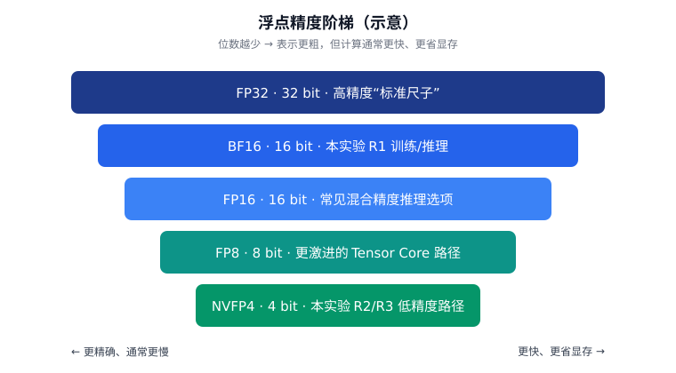
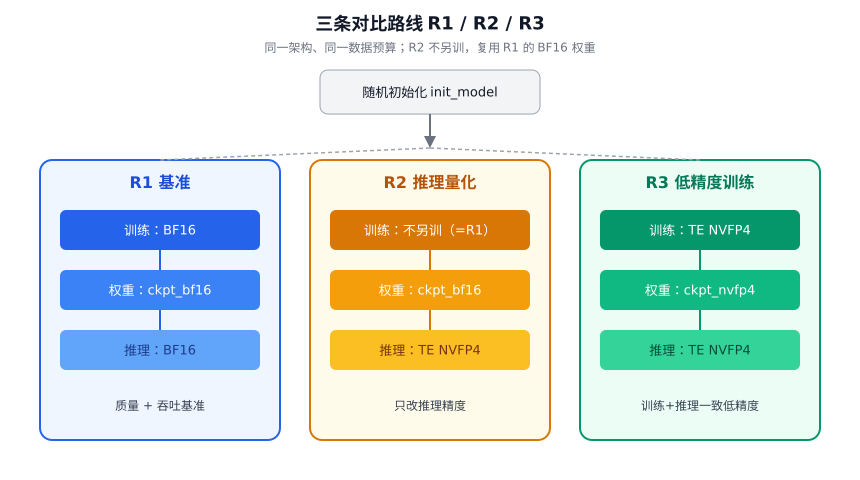
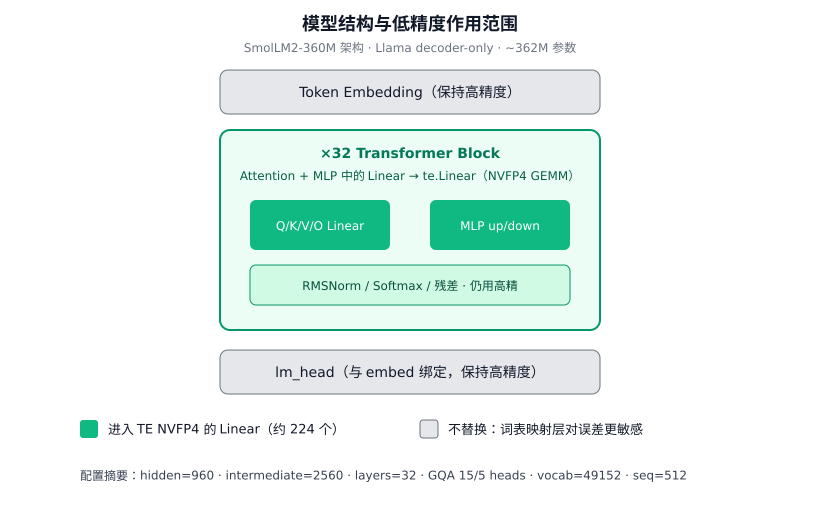
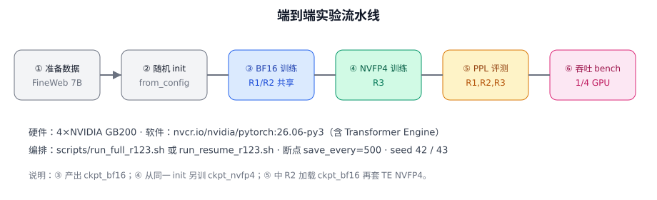
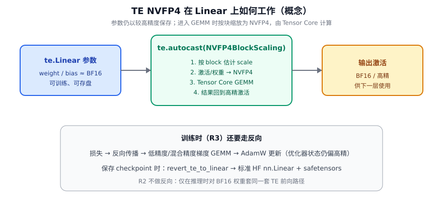
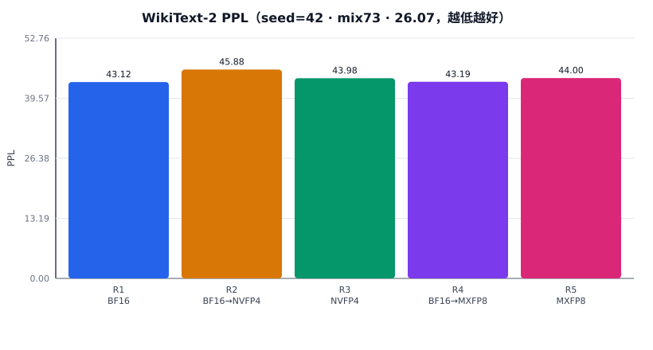
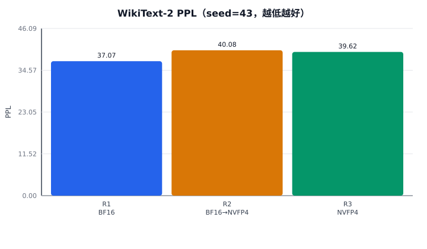
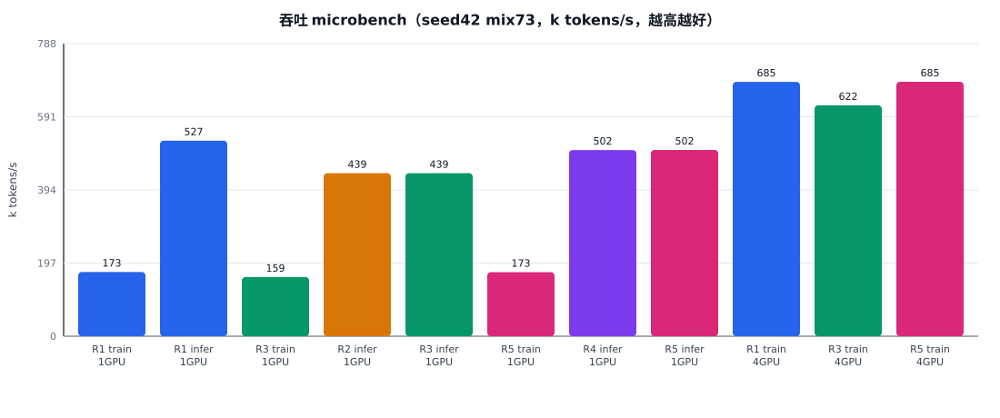

# R1 / R2 / R3 低精度训练与推理对比实验技术报告

**面向读者：** 具备基础深度学习与 Python 经验，**不要求**事先了解 FP8/FP4 或 Transformer Engine。  
**实验代码：** 仓库 `mxfp4_route_compare`  
**环境：** `nvcr.io/nvidia/pytorch:26.06-py3` · 4×NVIDIA GB200  
**主线配置：** SmolLM2-360M 架构 · FineWeb-Edu ~7B tokens · seed 42 / 43  

---

## 0. 摘要

大型语言模型训练与推理中的绝大部分计算，是矩阵乘法（GEMM）。若能在**可接受的质量损失**下，用更少比特表示参与乘法的数值，就有机会：

- 提高 Tensor Core 峰值吞吐；
- 降低显存占用与带宽压力。

本实验在**同一模型结构、同一数据预算、同一随机初始化协议**下，对比三条路线：

| 路线 | 训练 | 推理 | 权重文件 |
|------|------|------|----------|
| **R1** | BF16 | BF16 | `ckpt_bf16` |
| **R2** | 同 R1（不另训） | TE **NVFP4** | 复用 `ckpt_bf16` |
| **R3** | TE **NVFP4** | TE **NVFP4** | `ckpt_nvfp4` |

**质量指标：** WikiText-2 困惑度（PPL，越低越好）。  
**性能指标：** 训练/推理 tokens/s（microbench + 实训稳态）。

**主要结论（两 seed 一致）：**

1. **R3 略好于 R2**（NVFP4 训练比「只在推理时用 NVFP4」更有利）。  
2. 相对 R1，R2/R3 的 PPL 有**小幅上升**（约 +3%～+8% 相对）。  
3. 在本 **360M 规模** 设置下，NVFP4 训练约 **0.88–0.91×** R1 吞吐，推理约 **0.84–0.85×**——**尚未拿到理论加速**，原因见第 8 章。

---

## 1. 背景：从「精度」说起

### 1.1 浮点数在干什么？

计算机用有限位表示实数。常见浮点格式可以粗理解为：

> **符号位 + 指数位 + 尾数位**

- **指数** 决定能表示多大/多小的数（动态范围）。  
- **尾数** 决定小数有多精细（精度）。  

比特数越少，盒子越小：

- 同一加法/乘法可能更快（尤其有专用硬件时）；
- 但舍入误差更大，训练可能更难稳定。



### 1.2 本报告会用到的几种格式

| 名称 | 大致位数 | 在本实验中的角色 |
|------|----------|------------------|
| **FP32** | 32 | 优化器状态、部分累加等「账本」精度 |
| **BF16** | 16 | **R1** 训练与推理的主精度；动态范围接近 FP32，适合训练 |
| **FP16** | 16 | 业界常见推理选项；本实验 R1 **不采用**（与训练一致用 BF16） |
| **NVFP4** | 4 | **R2/R3** 通过 Transformer Engine 在 Linear GEMM 上使用的硬件 4bit 格式 |

不必背位宽细节，记住一句话即可：

> **BF16 是本实验的「全精度基准」；NVFP4 是作用在矩阵乘上的「更激进低精度」。**

### 1.3 混合精度：不是「整个模型只有一种数」

现代训练几乎都是**混合精度**：

| 对象 | 常见做法 | 直觉 |
|------|----------|------|
| 前向激活 | BF16 / 更低 | 算得快 |
| 权重主副本 | BF16 或 FP32 | 要稳 |
| 梯度 | 与激活类似 | 反传也要算 |
| 优化器动量等 | 常 FP32 | 更新要准 |

**低精度训练**通常指：在保证优化器等关键路径足够准的前提下，把**最耗时的 GEMM** 放到更低精度硬件上做。

### 1.4 为什么需要 Transformer Engine（TE）？

NVIDIA GPU 的 **Tensor Core** 对特定数据布局与缩放方式有硬性要求。  
**Transformer Engine** 提供：

- 与 PyTorch 对接的 `te.Linear`；
- **recipe**（配方），描述如何把张量变成 FP8/NVFP4 并做缩放；
- `te.autocast(...)`，在上下文中自动走低精度 GEMM。

本实验使用的 recipe 名为 **`NVFP4BlockScaling`**：按**块（block）**统计缩放因子，而不是对整个张量只用一个 scale。这能在 4bit 下保留更多动态范围。

---

## 2. 实验要回答的问题

我们固定：

- 同一套 **SmolLM2-360M 结构**（随机初始化，不是官方预训练续训）；
- 同一 **~7B FineWeb-Edu tokens** 训练预算；
- 同一评测：**WikiText-2 PPL** + **吞吐**。

然后比较：

1. **全 BF16** 好不好、多快？（R1）  
2. 若训练仍是 BF16，**只在推理时**把 Linear 换成 NVFP4，质量掉多少？（R2）  
3. 若**训练阶段就用 NVFP4 GEMM**，推理也用 NVFP4，能否比 R2 更好？（R3）  



**关键设计点：** R2 **不单独训练**——直接加载 R1 的 `ckpt_bf16`，在评估时替换 Linear 并开启 TE autocast。这样可以把「训练时见过低精度」与「只在推理时临时量化」分开。

---

## 3. 模型结构

### 3.1 架构来源与参数

| 项 | 值 |
|----|-----|
| 配置来源 | `HuggingFaceTB/SmolLM2-360M`（`from_config` 建空结构） |
| 实现类 | `LlamaForCausalLM` |
| 参数量 | 约 **362M** |
| 层数 | 32 |
| `hidden_size` | 960 |
| `intermediate_size` | 2560 |
| Attention heads / KV heads | 15 / 5（**GQA**） |
| `head_dim` | 64 |
| 词表 | 49152 |
| 位置编码 | RoPE（θ = 1e5） |
| 词嵌入与 lm_head | **权重共享（tie）** |

因果语言模型（decoder-only）的数据流：

```text
token id → Embedding → [Block × 32] → RMSNorm → lm_head → logits
```

每个 Block 大致包含：

- 自注意力（Q/K/V/O 等线性层）；
- 前馈网络 MLP（升维/降维线性层）；
- RMSNorm、残差连接、激活函数（SiLU）等。

### 3.2 低精度作用范围（量化 scope）

我们**没有**把整个网络所有张量都变成 4bit。实际策略是：

| 模块 | 是否走 TE NVFP4 |
|------|-----------------|
| Transformer block 内 `nn.Linear` | **是** → 替换为 `te.Linear` |
| Token embedding | **否** |
| `lm_head` | **否**（且与 embed 绑定） |
| RMSNorm / Softmax / 残差 | **否**（保持高精路径） |



**为什么 embed / lm_head 不动？**

1. 它们直接连着**离散词表**，对数值误差更敏感；  
2. 词表维度大、形状特殊，不一定适合当前 TE GEMM 约束；  
3. 业界低精度训练的常见做法也是「**算子里的大 Linear 低精度，词表层保守**」。

实测替换数量：约 **224** 个 block Linear。

---

## 4. 数据与训练配方

### 4.1 数据

| 用途 | 数据集 | 说明 |
|------|--------|------|
| 训练 | FineWeb-Edu `sample-10BT` | 流式采样后预 tokenize，写入 memmap `.npy` |
| 训练量 | **7e9 tokens** | 配置 `target_tokens: 7000000000` |
| 验证 | 同域约 1e6 tokens | 训练中看 val loss |
| 最终质量 | WikiText-2 raw test | 标准 LM 困惑度 |

预 tokenize 的好处：训练循环只做「从 memmap 取连续 token → 切成 seq_len」，避免每步在线分词拖慢 GPU。

不同 seed（42 / 43）使用不同的 shuffle，对应：

```text
data/fineweb_edu/train_tok7000000000_seed{42|43}.npy
```

### 4.2 关键超参（`configs/main_360m.yaml`）

| 超参 | 值 |
|------|-----|
| `seq_len` | 512 |
| 每卡 `batch_size` | 64 |
| `grad_accum` | 1 |
| GPU 数 | 4（DDP） |
| 全局 tokens/step | 64 × 512 × 4 = **131072** |
| 总 steps | 7e9 / 131072 ≈ **53406** |
| 优化器 | AdamW（β=(0.9, 0.95)） |
| 学习率 | 3e-4 → cosine 到 min 3e-5 |
| warmup | 2000 steps |
| weight decay | 0.1 |
| grad clip | 1.0 |
| 日志 | 每 50 step |
| 断点 | 每 **500** step 写 resume |

### 4.3 BF16 训练（R1）在代码里做了什么？

脚本：`scripts/02_train_bf16.py` → 公共循环 `mxfp4_lib/train_loop.py`。

简化流程：

1. 从 `init_model` 加载同一随机初始化；  
2. 模型 `.to(bfloat16)`，前向用 `torch.autocast(dtype=bfloat16)`；  
3. 反向 + AdamW 更新；  
4. 定期验证、写 `train_bf16.jsonl`；  
5. 结束时保存 HuggingFace 目录 `ckpt_bf16/`（`model.safetensors` 等）。

**R1 推理：** 评估时以 `torch_dtype=bfloat16` 加载，并继续 BF16 autocast——与训练口径一致。

### 4.4 端到端流水线



编排脚本：

- 从零：`scripts/run_full_r123.sh`  
- 安全续跑（不改名 seed 目录）：`scripts/run_resume_r123.sh`  

---

## 5. 「量化」在本实验中到底指什么？

初学者容易把三个概念混在一起，这里分开：

| 概念 | 本实验？ | 含义 |
|------|----------|------|
| **训练期低精度 GEMM** | R3 有 | 前向/反向的 Linear 乘法走 NVFP4 Tensor Core |
| **推理期低精度 GEMM** | R2、R3 有 | 同上，但只做前向 |
| **离线把权重压成 4bit 文件永久存储** | **没有** | 磁盘上仍是 HF 的 Linear 权重（高精存盘），需要时再挂 TE |

因此，更准确的说法是：

> 我们做的是 **硬件路径上的低精度矩阵乘（带 block scaling）**，而不是「导出一个只有 4bit 权重的部署包」。

### 5.1 Block scaling 的直觉

4bit 能表示的档位很少。若整层共用一个缩放，大数小数很难兼顾。  
**Block scaling** 把张量切成小块，每块各自有一个 scale：

```text
真实值 ≈ NVFP4码点 × scale_block
```

这样局部动态范围更大，更适合训练。

### 5.2 代码级步骤（R3 训练）

对应 `scripts/03_train_nvfp4.py` 与 `mxfp4_lib/te_linear.py`：

```text
1. 加载 init_model，转 BF16
2. get_preferred_recipe()  →  探测得到 NVFP4BlockScaling
3. replace_linears_with_te(model)  →  block Linear 换成 te.Linear
4. te_ctx = te.autocast(enabled=True, recipe=...)
5. train_loop(..., te_ctx=te_ctx)  →  每步前向/反向包在 te_ctx 里
6. 保存前 pre_save: revert_te_to_linear  →  写回 nn.Linear，便于 HF 生态
```



**参数仍是 BF16 存的**；低精度发生在 **autocast 包裹的计算过程中**。  
保存时 revert，是为了：

- 得到标准 `safetensors`；
- 避免 checkpoint 强绑定 TE 模块布局；
- 方便 R3 权重在评估时再次 `replace_linears_with_te`。

**实现细节：** 部分 `te.Linear` 在 `bias=False` 时仍注册**空 bias Parameter**，revert 时必须跳过 `numel==0` 的 bias，否则形状错误（本仓库已处理）。

### 5.3 R2 与 R3 在「推理」上的差别

两者评估时的计算图很像：都是 TE Linear + NVFP4 autocast。  
差别在于**权重从哪来**：

- **R2：** 权重只见过 BF16 训练；推理第一次「遇上」NVFP4 舍入；  
- **R3：** 训练过程中的梯度更新已经在低精度 GEMM 环境下发生过，权重更适应这条路径。

因此通常预期：**R3 的 PPL ≤ R2 的 PPL**（质量更好或相当）。实验结果支持这一预期。

---

## 6. 三条路线的实现对照

| 项目 | R1 | R2 | R3 |
|------|----|----|-----|
| 训练脚本 | `02_train_bf16.py` | 无（共用 R1） | `03_train_nvfp4.py` |
| 训练精度 | BF16 autocast | — | TE NVFP4 autocast |
| 权重目录 | `ckpt_bf16` | `ckpt_bf16` | `ckpt_nvfp4` |
| PPL 加载 | BF16 模型 | BF16 模型 + TE 替换 | NVFP4 导出权重 + TE 替换 |
| PPL 推理 | BF16 | NVFP4 | NVFP4 |
| 日志 | `train_bf16.jsonl` | — | `train_nvfp4.jsonl` |

公共能力都在 `mxfp4_lib/train_loop.py`：

- `torchrun` DDP；  
- cosine LR；  
- 周期性 resume（`model_state.pt` + `train_state.pt`）；  
- SIGTERM/SIGINT 时尽量落盘（适应开发机回收）。

评估入口：`scripts/05_eval_ppl.py --routes R1,R2,R3`。  
吞吐入口：`scripts/12_bench_throughput.py --route R1|R2|R3 --phase train|infer`。

---

## 7. 评测方法

### 7.1 质量：WikiText-2 PPL

**困惑度（Perplexity）** 衡量语言模型对测试文本有多「意外」：

\[
\mathrm{PPL} = \exp\big(\text{平均每 token 的交叉熵}\big)
\]

PPL 越低，说明模型越能预测下一个 token。

实现要点：

- 将 test 文本拼成长序列；  
- 用 `seq_len=512`、`stride=256` 滑窗；  
- 重叠部分 label 置为 -100，避免重复计分；  
- **TE 路径**下把序列长度 **pad 到 16 的倍数**（NVFP4 对 leading dim 有对齐要求），pad 位置不计入 NLL。

### 7.2 性能：tokens/s

我们报告两类数字：

1. **Microbench**（`12_bench_throughput`）  
   - 固定随机 batch，扫 batch size 打满显存；  
   - 隔离数据加载噪声，比较算子路径本身。  

2. **实训稳态**（jsonl 后 20% 平均）  
   - 含真实 data pipeline；  
   - 更接近「整晚训练」的体感速度。  

两者数量级不同，但 **R3 相对 R1 变慢** 的方向一致。

---

## 8. 实验结果

### 8.1 质量（WikiText-2 PPL）

#### Seed 42

| 路线 | Train | Infer | PPL | 相对 R1 |
|------|-------|-------|-----|--------:|
| R1 | BF16 | BF16 | **51.95** | 1.00× |
| R2 | BF16 | NVFP4 | **54.07** | 1.04× |
| R3 | NVFP4 | NVFP4 | **53.32** | 1.03× |

#### Seed 43

| 路线 | Train | Infer | PPL | 相对 R1 |
|------|-------|-------|-----|--------:|
| R1 | BF16 | BF16 | **37.07** | 1.00× |
| R2 | BF16 | NVFP4 | **40.08** | 1.08× |
| R3 | NVFP4 | NVFP4 | **39.62** | 1.07× |





**如何读这些数？**

1. **相对序稳定：** 两 seed 都是 R1 最好，R3 次之，R2 最差。  
2. **R3 优于 R2：** 训练时就暴露在 NVFP4 下，比「训完再临时低精度推理」更合理。  
3. **绝对 PPL 差很多：** 360M + 7B tokens 从零预训练，远未到「可用聊天模型」水平；seed 对绝对指标很敏感。比较路线时看**相对差**比看绝对分更有意义。  
4. R1 推理已统一为 **BF16**（与训练一致）；重测后与旧 FP16 推理数值几乎相同。

### 8.2 吞吐（seed 42 权重 microbench）

| 配置 | nGPU | tokens/s | 相对 R1 |
|------|-----:|---------:|--------:|
| R1 train | 1 | 174672 | 1.00× |
| R1 infer | 1 | **526460** | 1.00× |
| R3 train | 1 | 156553 | 0.90× |
| R2 infer | 1 | 444015 | 0.85× |
| R3 infer | 1 | 443179 | 0.84× |
| R1 train | 4 | 688153 | 1.00× |
| R3 train | 4 | 616741 | 0.90× |

实训稳态（4 卡 jsonl）：BF16 ~**555k–573k** tok/s；NVFP4 ~**439k–448k** tok/s。



### 8.3 为什么 NVFP4 反而比 BF16 慢？

直觉上「更低精度 = 更快」，但本实验是 **360M + TE 全链路**，出现约 **10%～15% 变慢**。主要原因：

1. **模型偏小**  
   大量时间花在 kernel 启动、归一化、注意力非 GEMM 部分；FP4 理论峰值用不满。

2. **TE 路径有额外开销**  
   block scale、格式转换、`te.Linear` 包装，对比原生 BF16 `nn.Linear` + cuBLAS 更「重」。

3. **混合精度中仍有大量高精工作**  
   优化器、部分激活、通信（DDP）并不都是 NVFP4；低精度只覆盖 block Linear GEMM。

4. **BF16 在 GB200 上已经非常快**  
   基准太强时，不成熟/有额外税的路径更容易「相对变慢」。

5. **这不否定 NVFP4**  
   更大模型、更长序列、更成熟 kernel 时，算术强度上升，FP4 更容易体现优势。本报告的结论应限定在 **当前规模与软件栈**。

---

## 9. 工程与可复现

### 9.1 软件环境

```text
镜像：nvcr.io/nvidia/pytorch:26.06-py3
关键库：PyTorch + Transformer Engine（镜像内置）
硬件：4×NVIDIA GB200
```

### 9.2 推荐复现命令

```bash
# 从零（容器内或通过 run_full_r123 拉起）
NPROC=4 SEED=42 bash scripts/run_full_r123.sh

# 机器被回收后安全续跑（不移动 seed 目录）
NPROC=4 SEED=43 bash scripts/run_resume_r123.sh

# 仅评测
python scripts/05_eval_ppl.py --config configs/main_360m.yaml --seed 42 --routes R1,R2,R3

# 吞吐（示例）
python scripts/12_bench_throughput.py --route R1 --phase infer --sweep --max-batch 192
```

### 9.3 产物布局

```text
checkpoints/seed_<N>/
  init_model/          # 共享随机初始化
  ckpt_bf16/           # R1/R2
  ckpt_nvfp4/          # R3
results/main_360m/seed_<N>/
  metrics.json         # PPL
  train_*.jsonl
  full_report.md
results/perf/bench_*_seed<N>_best.json
```

### 9.4 踩过的坑（对复现有用）

1. **开发机过期：** 依赖 NFS 上每 500 step 的 resume，换 IP 后 `run_resume_r123.sh`。  
2. **R3 最终 HF 导出：** TE 空 bias 导致 revert 失败时，用 `04_export_nvfp4_from_resume.py` 从 resume 导出。  
3. **评测序列对齐：** NVFP4 要求维度满足 16 倍数，PPL 已 pad。  
4. **多 seed bench 文件名：** 使用 `seed${SEED}` 后缀，避免互相覆盖。

---

## 10. 结论与局限

### 10.1 结论

1. 在统一设定下，建立了可复现的 **R1（BF16）/ R2（BF16 训 + NVFP4 推）/ R3（NVFP4 训推）** 对比流水线。  
2. **质量：** R3 略优于 R2；相对 R1 有小幅 PPL 代价。  
3. **速度：** 当前 360M + TE NVFP4 设置下，训练/推理均略慢于 BF16 基准；瓶颈在**规模与路径开销**，而非「FP4 算子必然更慢」的抽象命题。  
4. **工程：** 断点续训、TE 替换/还原、双 seed 结果已沉淀在脚本与文档中。

### 10.2 局限

- 模型小、token 预算有限，**绝对 PPL 高**，不代表大模型生产指标。  
- 未覆盖长上下文、多机、完整生成质量（只做 PPL 与吞吐）。  
- 吞吐结论依赖当前 TE/NGC 版本与 shape；换规模后需重测。  
- 未做「真正的 4bit 权重部署格式」端到端服务对比。

### 10.3 可延伸的问题

- 更大模型（≥1B）上 NVFP4 是否反超 BF16 吞吐？  
- 仅 MLP 或仅 Attention 投影走 NVFP4 的 Pareto 曲线？  
- 推理侧专用 kernel 与训练侧 TE 路径的差异？

---

## 附录 A. 符号与术语表

| 术语 | 一句话解释 |
|------|------------|
| BF16 | 16 位脑浮点，训练常用 |
| NVFP4 | NVIDIA 硬件 4bit 浮点格式（本实验经 TE 使用） |
| TE | Transformer Engine |
| Recipe | TE 的缩放与格式策略（如 NVFP4BlockScaling） |
| GEMM | 通用矩阵乘，Transformer 算力大户 |
| PPL | 困惑度，语言模型质量指标，越低越好 |
| DDP | 分布式数据并行 |
| GQA | 分组查询注意力（KV head 少于 Q head） |
| tokens/s | 每秒处理的 token 数，吞吐指标 |

## 附录 B. 脚本索引

| 脚本 | 作用 |
|------|------|
| `01_prepare_data.py` | 数据与 FineWeb 预取 |
| `01b_init_model.py` | 随机初始化 |
| `02_train_bf16.py` | R1/R2 训练 |
| `03_train_nvfp4.py` | R3 训练 |
| `04_export_nvfp4_from_resume.py` | 从 resume 导出 R3 HF 权重 |
| `05_eval_ppl.py` | R1/R2/R3 PPL |
| `12_bench_throughput.py` | 吞吐 microbench |
| `run_full_r123.sh` / `run_resume_r123.sh` | 编排 |
| `mxfp4_lib/te_linear.py` | TE 替换 / recipe / revert |
| `mxfp4_lib/train_loop.py` | 统一训练循环 |

## 附录 C. 图表与复现

| 文件 | 内容 |
|------|------|
| `docs/figures/fig01_dtype_ladder.svg` | 精度阶梯 |
| `docs/figures/fig02_routes_r123.svg` | 三路线 |
| `docs/figures/fig03_model_and_quant_scope.svg` | 模型与量化范围 |
| `docs/figures/fig04_pipeline.svg` | 流水线 |
| `docs/figures/fig05_te_forward.svg` | TE 前向概念 |
| `docs/figures/fig06_ppl_seed*.svg` | PPL 柱状图 |
| `docs/figures/fig07_throughput.svg` | 吞吐柱状图 |
| `docs/figures/plot_results.py` | 由 metrics/bench JSON 再生结果图 |

```bash
python docs/figures/plot_results.py
```

## 附录 D. 与简报文档的关系

- **`EXPERIMENT_SUMMARY.md`：** 数字一览与结论摘要。  
- **`RUN_STATUS.md`：** 运行状态与运维说明。  
- **本报告：** 面向学习的完整技术叙述（方法 + 实现 + 结果 + 解释）。

---

*报告版本与仓库实验结果一致（R1 推理 BF16 重测后）。如复跑评测，请以 `results/main_360m/seed_*/metrics.json` 为准更新表格。*
